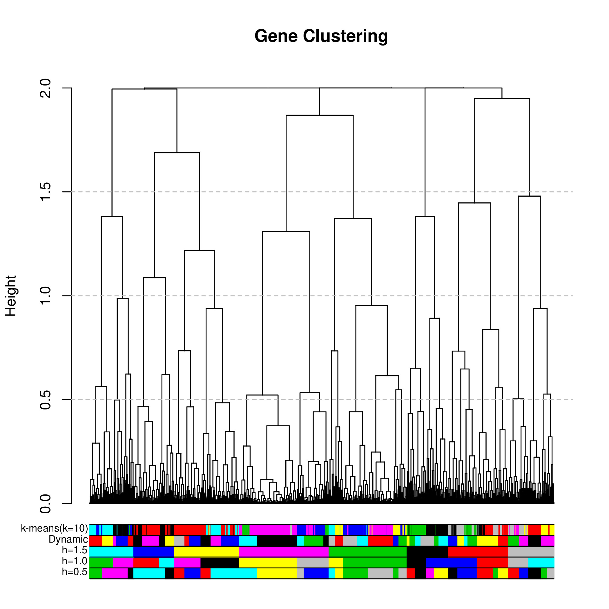

# RNA-Seq data from Ka-Wai Ma #

<!-- content start -->

**Table of Contents**

- [1. Introduction](#1-introduction)
- [2. Tasks](#2-tasks)
    - [2.1 Alignment](#21-alignment)
    - [2.2 Quantification](#22-quantification)
- [3. Progress](#3-progress)
    - [3.1 pre-processing](#31-pre-processing)
    - [3.2 Alignment](#21-alignment)
- [4. Results](#4-results)
    - [4.1 Aligned reads](#41-aligned-reads)
    - [4.2 DEGs](#42-DEGs)
    - [4.3 Cluster](#43-Cluster)
- [5. References](#5-references)
    
<!-- content end -->

## 1. Introduction ##

The *Arabidopsis thaliana* Col-0 treated with flg22, SynCom33+flg22, and SynCom35+flg22.

> reference genomes path `/netscratch/dep_psl/grp_rgo/yniu/ref`

> RNA-seq data path `/biodata/dep_psl/grp_rgo/metatranscriptomics/data/flg22`

| sample number | genotype At    | organ | flg22 | bacteria  | biological replicate | Library title | Library number | Library state | Reads requested | Reads sequenced | 
|---------------|----------------|-------|-------|-----------|----------------------|---------------|----------------|---------------|-----------------|-----------------| 
| a             | pWER::FLS2-GFP | roots | 0.00  | no        | 1                    | a.1           | 4016.A.2       | Draft         | 20,000,000      | 0.0             | 
| b             | pWER::FLS2-GFP | roots | 1.00  | no        | 1                    | b.1           | 4016.B.2       | Draft         | 20,000,000      | 0.0             | 
| c             | pWER::FLS2-GFP | roots | 1.00  | SynCom33  | 1                    | c.1           | 4016.C.2       | Draft         | 20,000,000      | 0.0             | 
| d             | pWER::FLS2-GFP | roots | 1.00  | SynCom35  | 1                    | d.1           | 4016.D.2       | Draft         | 20,000,000      | 0.0             | 
| e             | pWER::FLS2-GFP | roots | 0.00  | no        | 2                    | e.1           | 4016.E.2       | Draft         | 20,000,000      | 0.0             | 
| f             | pWER::FLS2-GFP | roots | 1.00  | no        | 2                    | f.1           | 4016.F.2       | Draft         | 20,000,000      | 0.0             | 
| g             | pWER::FLS2-GFP | roots | 1.00  | SynCom33  | 2                    | g.1           | 4016.G.2       | Draft         | 20,000,000      | 0.0             | 
| h             | pWER::FLS2-GFP | roots | 1.00  | SynCom35  | 2                    | h.1           | 4016.H.2       | Draft         | 20,000,000      | 0.0             | 
| i             | pWER::FLS2-GFP | roots | 0.00  | no        | 3                    | i.1           | 4016.I.2       | Draft         | 20,000,000      | 0.0             | 
| j             | pWER::FLS2-GFP | roots | 1.00  | no        | 3                    | j.1           | 4016.J.2       | Draft         | 20,000,000      | 0.0             | 
| k             | pWER::FLS2-GFP | roots | 1.00  | SynCom33  | 3                    | k.1           | 4016.K.2       | Draft         | 20,000,000      | 0.0             | 
| l             | pWER::FLS2-GFP | roots | 1.00  | SynCom35  | 3                    | l.1           | 4016.L.2       | Draft         | 20,000,000      | 0.0             | 

> analysis path `/netscratch/dep_psl/grp_rgo/yniu/KaWaiFlg22`

## 2. Tasks ##

### 2.1 Alignment ###

* Align reads to *Arabidopsis thaliana* Col-0 genomes (HISAT2) and cDNAs (Kallisto)

### 2.2 Quantification ###

* Quantification transcripts.

* Differentially expressed genes.

## 3. Progress ##

### 3.1 Pre-processing ###

* Trim by [fastp](https://github.com/OpenGene/fastp) with stringent parameters that remove the 8-mer in the head and 2-mer in the tail of each read.

### 3.2 Alignment ###

* Use Kallisto and HISAT2 to align reads.

## 4. Results ##

### 4.1 Aligned reads ###

* Alignment rates

| sample           | rawfq    | trimfq   | H_ath | K_ath | 
|------------------|----------|----------|-------|-------| 
| Mock_1           | 16978228 | 16881903 | 0.977 | 0.962 | 
| Mock_2           | 18851317 | 18723047 | 0.979 | 0.966 | 
| Mock_3           | 18313224 | 18218407 | 0.98  | 0.966 | 
| Flg22_1          | 17512255 | 17422675 | 0.971 | 0.954 | 
| Flg22_2          | 18047704 | 17950283 | 0.975 | 0.959 | 
| Flg22_3          | 17922052 | 17826125 | 0.974 | 0.957 | 
| Flg22_SynCom33_1 | 17785611 | 17687693 | 0.974 | 0.955 | 
| Flg22_SynCom33_2 | 16929833 | 16832003 | 0.975 | 0.96  | 
| Flg22_SynCom33_3 | 20093432 | 19984770 | 0.974 | 0.956 | 
| Flg22_SynCom35_1 | 17361283 | 17267286 | 0.965 | 0.952 | 
| Flg22_SynCom35_2 | 16914038 | 16825207 | 0.979 | 0.966 | 
| Flg22_SynCom35_3 | 21203518 | 21099083 | 0.972 | 0.957 | 

> "K" and "H" is for Kallisto and HISAT2 alignment.

* Kallisto alignment example


* HISAT2 alignment example


* PCA plot


> rlog (regularized log transformation) in PCA.

### 4.2 DEGs ###

```
                      condition
Mock_1                     Mock
Mock_2                     Mock
Mock_3                     Mock
Flg22_1                   Flg22
Flg22_2                   Flg22
Flg22_3                   Flg22
Flg22_SynCom33_1 Flg22_SynCom33
Flg22_SynCom33_2 Flg22_SynCom33
Flg22_SynCom33_3 Flg22_SynCom33
Flg22_SynCom35_1 Flg22_SynCom35
Flg22_SynCom35_2 Flg22_SynCom35
Flg22_SynCom35_3 Flg22_SynCom35
```

* 3 groups (flg22, flg22_SynCom33, and flg22_SynCom35) *vs.* Mock

[results/eachGroup_vs_Mock_k_full.csv](results/eachGroup_vs_Mock_k_full.csv) (remove genes with zero count) and [results/eachGroup_vs_Mock_k.csv](results/eachGroup_vs_Mock_k.csv) (remove gene with at least two zero count in one condition).

* 2 groups (flg22_SynCom33 and flg22_SynCom35) *vs.* flg22

[results/SynCom_vs_flg22_k_full.csv](results/SynCom_vs_flg22_k_full.csv) and [results/SynCom_vs_flg22_k.csv](results/SynCom_vs_flg22_k.csv).

* 1 groups flg22_SynCom35 *vs.* flg22_SynCom33

[results/SynCom35_vs_SynCom33_k_full.csv](SynCom35_vs_SynCom33_k_full.csv) and [results/SynCom35_vs_SynCom33_k.csv](results/SynCom35_vs_SynCom33_k.csv).

> logarithm transformation in columns `Mock_1` to `Flg22_SynCom35_3`.

### 4.3 Cluster ###

Hierarchical clustering to find potential gene expression patterns in four conditions (`Mock`, `flg22`, `SynCom33`, and `SynCom35`). The read count of each transcript was scaled, then average value was used to represent each condition. Transcript with more than one zero counts in any of the four conditions were excluded (29161 transcripts left).

* Hierarchical clustering of 29161 transcripts. 

Distance was calculated as `1 - Pearson's Correlation Coefficient`



* Cut trees to get clusters

  height threshold `0.5`
  
  
  
  ```
  AT1G14550.1 AT2G30750.1 AT2G19190.1 
         21          26          20 
  ```

  height threshold `1.0`
  
  
  
  ```
  AT1G14550.1 AT2G30750.1 AT2G19190.1 
          9          14          14 
  ```
  
  height threshold `1.5`
  
  
  
  
  
  
  ```
  AT1G14550.1 AT2G30750.1 AT2G19190.1 
          7           7           7 
  ```
  
  correlation of traits (phenotype) and clusters
  
  ```
  flg22 SynCom33 SynCom35 rootlen
    0        0        0     5.5
    1        0        0     1.1
    1        1        0     1.3
    1        0        1     4.8
  ```
  
  
  
  heatmaps
  
  
  
  
  
  
  
  
  
  
  
  
  
## 5 References ##

* Garrido-Oter R, Nakano RT, Dombrowski N, Ma KW; AgBiome Team, McHardy AC, Schulze-Lefert P. **Modular Traits of the Rhizobiales Root Microbiota and Their Evolutionary Relationship with Symbiotic Rhizobia** *Cell Host Microbe.* 2018;24(1):155-167.e5.

<!-- * [Clustering RNAseq data, making heatmaps, and tree cutting to identify gene modules.](https://2-bitbio.com/2017/04/clustering-rnaseq-data-making-heatmaps.html) -->


