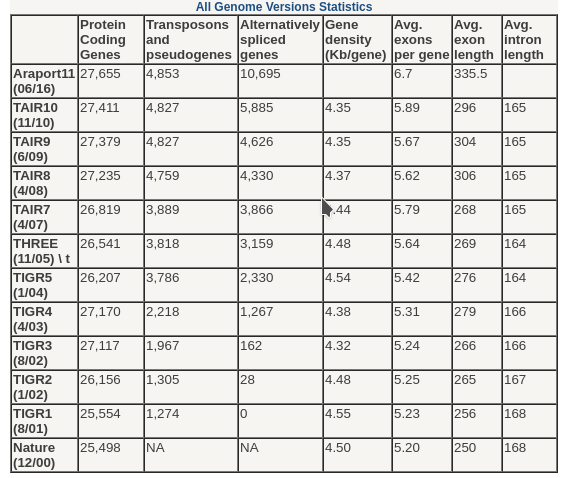
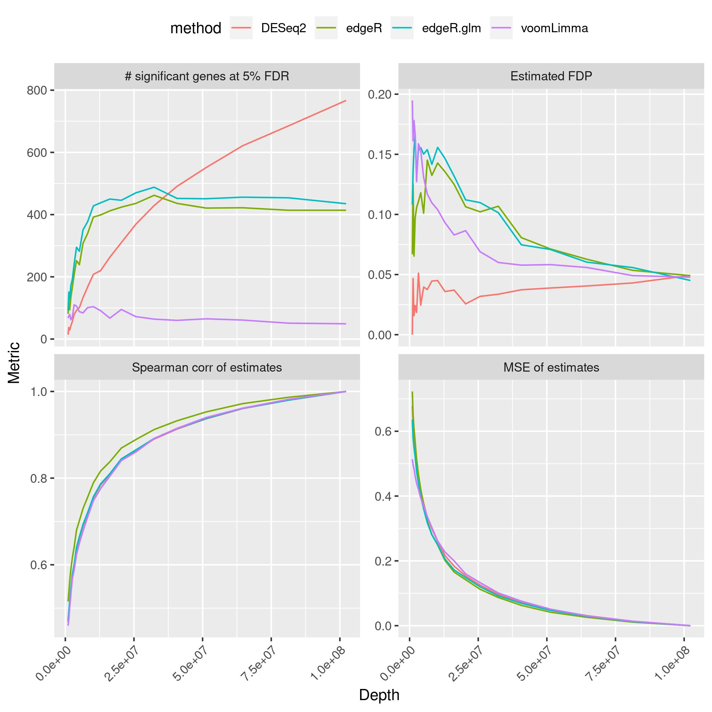
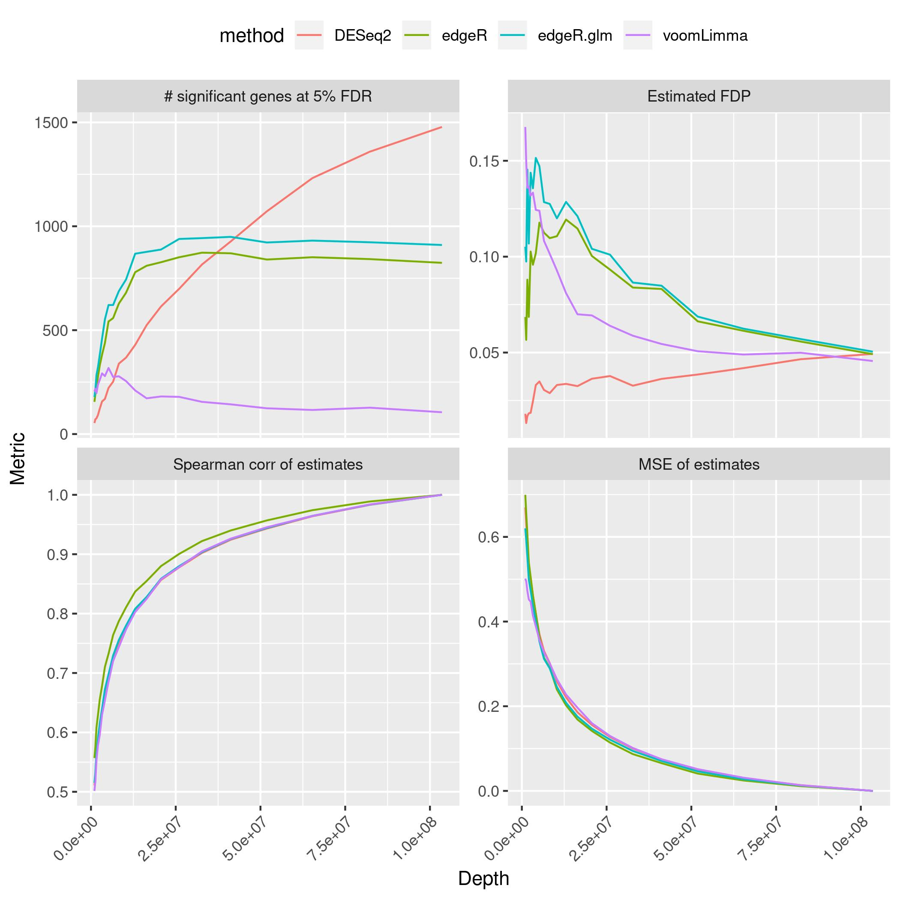
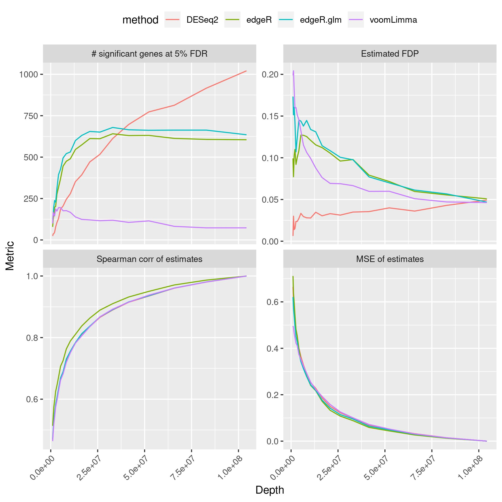

# How many reads are enough for Arabidopsis RNA-Seq?

<!-- content start -->

**Table of Contents**

- [1. Estimation](#1-Estimation)
    - [1.1 Exons](#11-exons)
    - [1.2 Transcripts](#12-transcripts)
- [2. subSeq](#2-subseq)
- [3. References](#2-references)

<!-- content end -->

## 1. Estimation

### 1.1 Exons

Estimate coverage from exons, and we assuming that the read length is `150bp`

1. Retrieve exons from [Ensembl database](ftp://ftp.ensemblgenomes.org/pub/plants/release-43/gff3/arabidopsis_thaliana/Arabidopsis_thaliana.TAIR10.43.gff3.gz) (Araport11). A total of `193,130` non-redundant exons with average length of `336.4bp`.

```
   Coverage `Reads (million)`
   <chr>                <dbl>
 1 0.1X                0.0433
 2 0.5X                0.217 
 3 1X                  0.433 
 4 2X                  0.866 
 5 3X                  1.30  
 6 5X                  2.17  
 7 10X                 4.33  
 8 15X                 6.50  
 9 20X                 8.66  
10 30X                13.0   
11 40X                17.3   
12 50X                21.7   
```

2. Directly use the summary table from the [TAIR](https://arabidopsis.org/portals/genAnnotation/gene_structural_annotation/annotation_data.jsp) database.



```
   Coverage `Reads (million)`
   <chr>                <dbl>
 1 0.1X                0.0414
 2 0.5X                0.207 
 3 1X                  0.414 
 4 2X                  0.829 
 5 3X                  1.24  
 6 5X                  2.07  
 7 10X                 4.14  
 8 15X                 6.22  
 9 20X                 8.29  
10 30X                12.4   
11 40X                16.6   
12 50X                20.7   
```

### 1.2 Transcripts

Retrieve transcripts from [Ensembl database](ftp://ftp.ensemblgenomes.org/pub/plants/release-43/gff3/arabidopsis_thaliana/Arabidopsis_thaliana.TAIR10.43.gff3.gz) (Araport11), which including 3,746 lncRNA and 43,256 mRNA sequences.

```
   Coverage `Reads (million)`
   <chr>                <dbl>
 1 0.1X                0.0761
 2 0.5X                0.381 
 3 1X                  0.761 
 4 2X                  1.52  
 5 3X                  2.28  
 6 5X                  3.81  
 7 10X                 7.61  
 8 15X                11.4   
 9 20X                15.2   
10 30X                22.8   
11 40X                30.5   
12 50X                38.1 
```

## 2. subSeq

Randomly drop reads, then test the number of significantly changed genes, false discovery proportions (FDP), Spearman correlation and mean-squared error (MSE).

* flg22 *vs.* Mock



* flg22+SynCom33 *vs.* Mock



* flg22+SynCom35 *vs.* Mock



## 3. References

1. Robinson DG, Storey JD: **subSeq: determining appropriate sequencing depth through efficient read subsampling.** *Bioinformatics*. 2014;30(23):3424-6.


